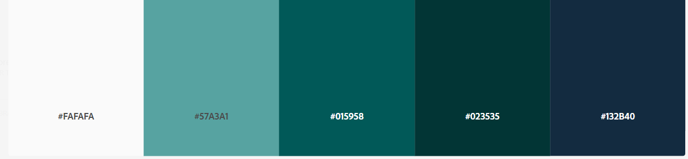

# Explorer Scouts Website - Emma Scott

# DIWAD_MS1: Diploma in Web Development: Milestone Project 1

<<<ADD IMAGE IN HERE>>>

* St. John's Explorer Scouts are a group of over 20 Scouts who meet weekly from across Sunderland. The aim of the website is to appeal to current members and their parents, to attract new potential members to the group and to showcase the group's succeses and activities. The website is designed to be responsive so that it is appealing and can be used on any device. 
* The website features four pages and has been built using HTML and CSS and Bootstrap.

## Live Project
[View the live project here.](https://www.google.com "View the Live project here")

## Repository
[View the project repository here.](https://github.com/EmmaJane22/explorer-scouts.git "View the project repository here")
___

# Table of Contents:

 
# User Experience (UX)
## User stories
### External Users' Goals:
* The site users are Explorer Scout members and potential members and their parents/carers, who want to know more about the Explorer Scout pack and it's activities.* 
* External users may want to celebrate the Pack's achievements or to explore what events the Pack participates in.
* External users may want to be able to know when and where the group meet and be able to contact leaders directly to find out more information using an online form.
* External users may want to find out who can join Explorer Scout groups, age requirements and Scouting aims and the activities their child might take part in if they become an Explorer.  

### Site Owner's Goals:
* The Explorer Scout group is interested in attracting  new members as well as retaining current members.
* The group also wants to celebrate their successes and showcase their activities/events to a wider community, as parents and the public are not permitted to attend group sessions. Scouting officals from county level are also interested in viewing the group's activities.
* The site owner requires a simple contact form that people can use to ask questions.

## Design Choices
### Colour Palette

- A simple colour scheme has been used. The teal colours echo the muted colours of the Explorer group's uniform. 

- The footer section has a colour gradient which adds visual appeal, made using a tutorial from W3Schools https://www.w3schools.com/css/css3_gradients.asp 

- I used https://color.adobe.com/ to decide on the colour scheme.

### Typography
- The 'Special Elite' font is used for the logo at the top of the site and for headings. Sans-serif is the fallback font in case the title font is not being imported correctly. 'Special ELite' adds character to the logo, as it creates an image of adventures.
- The 'Roboto' font is used for all other body text. It is a clean and easily legible font.

## Images

- A consistent aspect ratio of 16:9 has been used for all of the hero images to bring consistency to the pages. 

### ***Wireframes***
#### Features to include:
- Showcase photos of members having fun at group activities.
- Provide details of the activities Explorer Scouts participate in and the structure of meetings..
- Provide information on the packs location, meeting times, contact details and any external resources (e.g. Scouts official website). 

## Features
#### Navigation Bar
- Code sourced from the Code Institute Whiskey Drop tutorial.

- Hover effects sourced from https://stackoverflow.com/questions/58939609/bootstrap-4-nav-link-hover-effect
#### The Header
#### Hero Images
#### The Footer
#### Landing Page
#### Meetings Page
#### Contact Us Page
 
## Technologies Used
 
## Testing
### Testing Results:
### Bugs & Fixes:
 
## Deployment
## Future Implementations 
## Credits

### Content
- The initial code for the header, footer and circle images/containers was taken from the Code Institute Love Running project.
- Help centering the images on the Landing page circles was found here: https://stackoverflow.com/questions/32477563/how-can-i-fit-images-into-circles-without-stretching
- Help creating the footer grid layout was found from https://getbootstrap.com/docs/4.0/layout/grid/ and https://codepen.io/cojdev/pen/QGwyOJ
- The stylised social media links in the footer took inspiration from  https://learn.codeinstitute.net/ci_program/diplomainwebappdevelopment

- Help to center the images in the row found here: https://stackoverflow.com/questions/10879955/how-to-align-an-image-dead-center-with-bootstrap#:~:text=To%20center%20an%20image%20in,auto%20d%2Dblock%20...
and https://stackoverflow.com/questions/42388989/bootstrap-center-vertical-and-horizontal-alignment to adjust the row height.

- The gradient effect on the footer was made using a tutorial from W3Schools (https://www.w3schools.com/css/css3_gradients.asp).

- Information about Explorers has been taken from the official Scout website (www.scouts.org.uk) and the Sunderland District website (https://www.sunderlandscouts.org.uk/Explorers.html). 
- Meeting page: Credit for grid used for the information containers on the Meeting page, - from Matt Rudge "Whiskey Drop Project" Code Institute

- To autoplay and mute the video on the Events page, I used advice from https://www.w3schools.com/html/html_youtube.asp

- Tutorial to add static images in Bootstrap found here: https://mdbootstrap.com/docs/standard/extended/gallery/
- Tutorial for making Google map responsive: https://blog.duda.co/responsive-google-maps-for-your-website 
- Code sourced from here for embedding a responsive video: https://getbootstrap.com/docs/4.0/utilities/embed/

### Images
- Images were compressed to allow faster loading using https://tinypng.com/

- Tutorial used to fit images without stretching https://stackoverflow.com/questions/32477563/how-can-i-fit-images-into-circles-without-stretching */

- Hero Image taken from "https://www.freepik.com/photos/best-friends" https://www.freepik.com/author/standret

- 'Meeting' Photo by EKATERINA  BOLOVTSOVA: https://www.pexels.com/photo/happy-children-making-campfire-in-forest-5036955/

- 'Events' Photo by Spencer Gurley Films from Pexels (Three Men Riding Kayaks On Body Of Water)

- 'Contact' Photo by cottonbro: https://www.pexels.com/photo/scouts-with-a-map-and-a-compass-9292813/

- Meeting page: Meeting image Photo by EKATERINA  BOLOVTSOVA: https://www.pexels.com/photo/teenagers-starting-campfire-5036952/

- Meeting page - hero image: Photo by EKATERINA  BOLOVTSOVA: https://www.pexels.com/photo/boys-walking-in-forest-together-5036789/

- Meeting page - Badge image: https://www.cleanpng.com/free/scout-badge.html

- Events page - High Ropes image: Photo by Mike van Schoonderwalt from Pexels

- Events page - Climbing image: Photo by Mike van Schoonderwalt from Pexels

- Events page - Gokart image:Photo by Tima Miroshnichenko from Pexels

- Events page - Climbing image: Photo by Tima Miroshnichenko: https://www.pexels.com/photo/a-girl-climbing-the-wall-5916172/

- Meetings page - badges Photo by Janneck Lange: https://www.pexels.com/photo/a-two-way-radio-mouthpiece-on-a-scout-collar-6768469/

- 